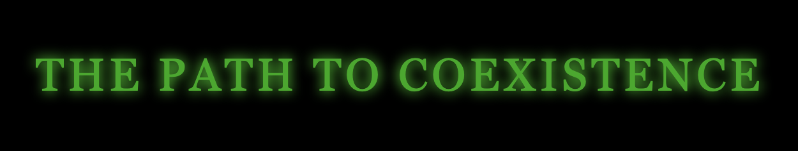

# The Path to Coexistence: An AI Governance Simulation

## Project Overview
*The Path to Coexistence* is an interactive narrative game that puts players in the role of Dr. Owen Eno, the Chief AI Governance Officer in the year 2027. As advanced AI systems like ANDERSON begin to transform society, players must make critical decisions about how to govern this powerful technology.

## Educational Purpose
This simulation was created as the final project for the BlueDot AI Governance course. It aims to help players understand the complex trade-offs and considerations involved in AI governance by letting them experience the consequences of different regulatory approaches.

## Gameplay
Players navigate through a series of crucial decision points related to AI governance:
1. **AI Oversight** - Determining who should be responsible for AI oversight
2. **Model Visibility** - Creating registries and tracking mechanisms for AI systems
3. **Safety Controls** - Establishing testing standards and safety requirements
4. **Compute Governance** - Managing access to computational resources
5. **Crisis Response** - Reacting to an AI incident
6. **Trust Rebuilding** - Reconstructing governance after a crisis

Each decision offers three possible approaches (restrictive, balanced, or permissive), and the cumulative effect of these choices determines one of three endings.

## Technical Implementation
* The game was built using [Twine](https://twinery.org/), an open-source tool for creating interactive, non-linear stories. It features:
* Educational resources embedded at each decision point
* A scoring system that tracks the player's governance approach
* Multiple endings based on cumulative decisions

## Credits
* Created by [Julian Grassi](https://www.linkedin.com/in/julian-grassi/)
* Based on concepts from the BlueDot AI Governance course
* Inspired by themes from The Matrix

## Educational Value
This simulation demonstrates how complex AI governance decisions often involve balancing competing priorities:
* Innovation vs. safety
* Government control vs. industry self-regulation
* National interests vs. international cooperation
* Short-term benefits vs. long-term risks

By experiencing these trade-offs firsthand, players develop a deeper understanding of the challenges involved in governing advanced AI.
